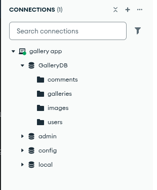
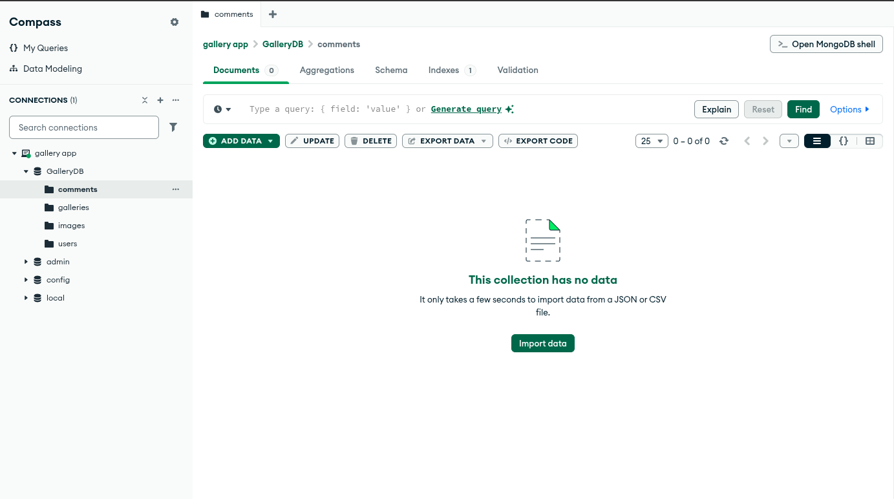
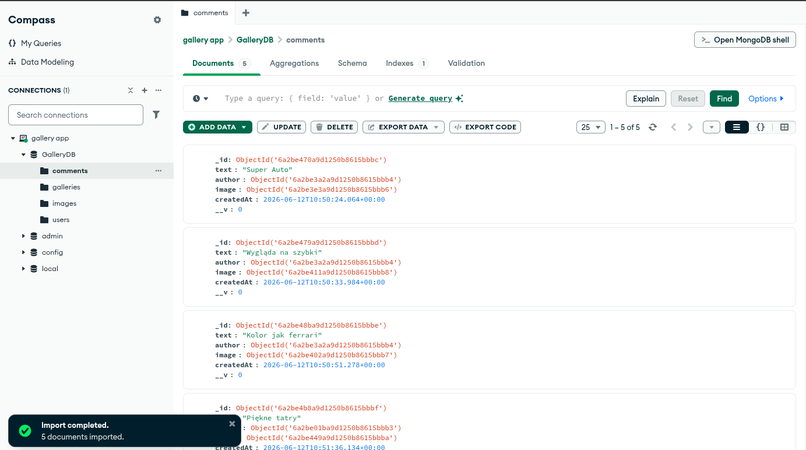

# Instrukcja uruchomienia

### Uruchom MongoDB np. przy użyciu dockera:

```cmd
docker run -d -p 27017:27017 --name mongo-gallery mongo:latest
```

---

### Zainstaluj zależności

```cmd
npm install
```

---

### Zmienne środowiskowe

Stwórz plik `.env` i skopiuj klucz `JWT_SECRET` z pliku `.env.example`

---

### Uruchom aplikację

```cmd
npm start
```

---

### Połącz się z bazą danych poprzez MongoDB Compass

Zaimportuj pliki z folderu `./database-data` do odpowiednich kolecji bazy danych `GalleryDB`

## 

Kliknij `import` i wybierz odpowiedni plik do danej kolekcji

## 

Oczekiwany widok po udanym imporcie:



> Przykładowe pliki zdjęć są już zamieszczone na serwerze w folderze `/public/images/`. Po zaimportowaniu bazy będą od razu poprawnie wyświetlane.

### Po zaimportowaniu wszystkich kolekcji można przejść do testowania aplikacji pod adresem `http://localhost:3000/`

---

### Dostępni użytkownicy:

1. **Admin** - login: `admin` hasło: `admin`
2. **Normalny użytkownik** - login: `piotrek` hasło: `piotreks`
3. **Normalny użytkownik** - login: `marek` hasło: `12345678`

---

### Funkcjonalności:

- **Zarządzanie galeriami:** Tworzenie, edycja i usuwanie własnych galerii.
- **Zarządzanie zdjęciami:** Wgrywanie zdjęć na serwer z przypisaniem do konkretnej galerii, edycja nazwy, opisu, przynależności do galerii, usuwanie zdjęcia, obsługa komentarzy.
- **Panel Administratora:** Dostęp do wszystkich galerii i zdjęć oraz możliwość zarządzania użytkownikami(dodawanie, usuwanie).

---

### Wykorzystane pakiety

- `express` - rdzeń aplikacji.
- `mongoose` - modelowanie danych dla bazy MongoDB.
- `pug` - obsługa widoków.
- `formidable` - obsługa formularzy oraz przesyłania plików na serwer.
- `express-validator` - walidacja danych wejściowych z formularzy.
- `dotenv` - zarządzanie zmiennymi środowiskowymi (JWT token).
- `swagger-ui-express` & `swagger-jsdoc` - generowanie dokumentacji API

---

### Struktura projektu

- `/models` - schematy bazy danych.
- `/controllers` - logika i obsługa żądań.
- `/routes` - definicje endpointów i mapowanie ich na kontrolery.
- `/views` - szablony Pug .
- `/public` - pliki statyczne (wgrane przez użytkowników zdjęcia w folderze `/images`).

### Opis modeli bazy danych

1. **User**
   - `first_name` (String) - Imię.
   - `last_name` (String) - Nazwisko.
   - `username` (String) - Unikalny login.
   - `password` (String) - Hasło.

2. **Gallery**
   - `name` (String) - Nazwa galerii.
   - `owner` (ObjectId) - Referencja do kolekcji `User` .

3. **Image**
   - `name` (String) - Nazwa pliku.
   - `description` (String) - Opis zdjęcia.
   - `path` (String) - Ścieżka do pliku na serwerze
   - `gallery` (ObjectId) - Referencja do kolekcji `Gallery`, w której znajduje się zdjęcie

4. **Comment**
   - `text` (String) - Treść komentarza (ograniczona do 1000 znaków).
   - `author` (ObjectId) - Referencja do kolekcji `User` (autor komentarza).
   - `image` (ObjectId) - Referencja do kolekcji `Image`
   - `createdAt` (Date) - Data i czas utworzenia komentarza.

---

### Dokumentacja Interfejsu API (OpenAPI)

Dokumentacja obsługiwanych metod HTTP została wygenerowana automatycznie przy pomocy biblioteki Swagger. Znajduje się pod adresem: `http://localhost:3000/api-docs/`
